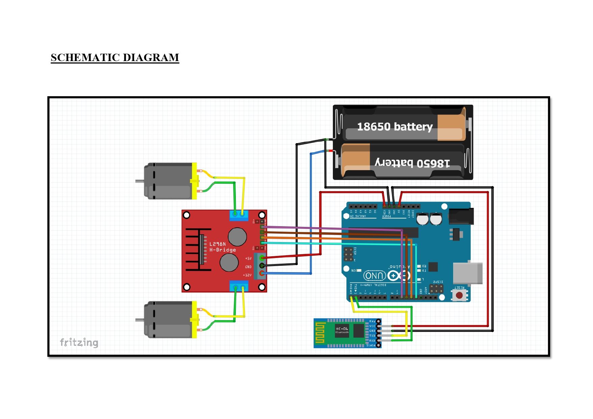

# ROBO CAR ARDUINO - BLUETOOTH CONTROL

## Alat & Bahan :
- Arduino
- Modul Bluetooth (Rekomen. HC-05/06)
- Driver Motor (L298/L298N)
- DC Motor
- 2x Baterai 18650 + Box
- Kabel Jumper + Switch

## Apps :
- Bluetooth RC Control (Android)

## Skema
